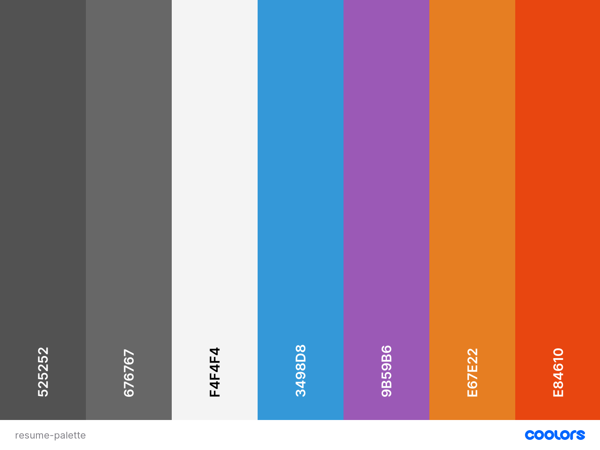

#  #
***Resume Project** is a website created on the COde Institute Full Stack Software Developer level 5 Diploma course User-Centric Design modules.*
*The objective is to create a User Resumé utilising User Centric Design principles focussing on agile development and mobile first design in HTML5 and CSS3 with Bootstrap css and Hover.css frameworks.*

## Contents ##

- [Logo](#img-srcwireframeslogo-imagejpg-altlogo)
  - [Contents](#contents)
  - [UX (User Experience)](#ux-user-experience)
    - [Project Goals](#project-goals)
    - [User Goals](#user-goals)
    - [User Stories](#user-stories)
    - [Site Owner Goals](#site-owner-goals)
    - [User Requirements and Expectations](#user-requirements-and-expectations)
  - [Design Choices](#design-choices)
    - [Fonts](#fonts)
    - [Colours](#colours)
    - [Wireframes](#wireframes)
  - [Technologies](#technologies)
    - [Languages](#languages)
    - [Libraries](#libraries)
    - [Tools](#tools)
  - [Features](#features)
    - [Features Implemented](#features-implemented)
    - [Future Features](#future-features)
  - [Testing](#testing)
  - [Bugs](#bugs)
  - [Deployment](#deployment)
    - [Running [repo name] Locally](#running-bi-team-5-locally)
  - [Credits](#credits)
    - [Images](#images)
    - [Colour](#colour)
    - [Image editing](#image-editing)
    - [Acknowledgements](#acknowledgements)

## UX (User Experience) ##

## User Goals ##

- **Book** a table in the coffee shop for a specific time.
- **Order** a coffee **online** for collection.
- **Link** to the coffee shop social media sites.

## User Stories ##

- As a **user**, I want to ...
- As a **user**, I want to ...
- As a **user**, I can ...
- As a **user**, I can ...

## Site Owner Goals ##

- As a **site owner**, I want to create ...
- As a **site owner**, I want the user to be able to ..
- As a **site owner**, I want my users to be able to ...

## User Requirements and Expectations ##

- **Header**, **Main body** divided into section and **Footer**
- In the **Header** we should see a **Logo** and a **navigation bar** on the left side with option to go to:
  - **Home section** (top of the site)
  - ...
  - ...
  - **Contact us** section
- On the right side of the **Header** you should see additional ...

- In the **Main body** we should see:
  - **Welcome** section with a welcome message
  - ...
  - ...
  - **Contact us** section displaying google maps with the coffee shop location
- In the **Footer** You should see self-explanatory icons allowing the user to connect them with the shop's social media channels.
  
## Design Choices ##

### Fonts ###

We have chosen [Exo](https://fonts.google.com/specimen/Exo?category=Sans+Serif) for all of the headers and [Roboto](https://fonts.google.com/specimen/Roboto?category=Sans+Serif) the rest of the text.

### Colours ###

We have chosen the colour that say ... appealing to the eye and also compliments the design of the project.


- *Davys Grey* (525252) - Dark Grey
- *Dim Grey* (676767) - Mid Grey
- *Cultured* (F4F4F4) - Off white
- *Carolina Blue* (3498D8) - Light Blue
- *Purple Plum* (9B59B6) - Purple
- *Cadmium Orange* (E67E22) - Orange
- *Flame* (E84610) - Dark Orange

These colours will compliment each other well when used across the site creating a contrasting and dynamic ambience.

### Wireframes ###

We designed our site mock-ups using [balsamiq wireframes](https://balsamiq.com/). We were focusing on defining basic layout structure of the site and identifying how displays would change on different screen sizes such as [mobile](/wireframes/mobile.jpg), [tablet](/wireframes/tablet.jpg) and [desktop](/wireframes/desktop.jpg).

---  

## Technologies ##

### Languages ###

- [HTML](https://developer.mozilla.org/en-US/docs/Web/HTML)
- [CSS](https://developer.mozilla.org/en-US/docs/Web/CSS)
- [JavaScript](https://developer.mozilla.org/en-US/docs/Web/JavaScript)

### Libraries ###

- [jQuery](https://jquery.com/)
- [Popper](https://popper.js.org/)
- [Bootstrap](https://getbootstrap.com/)
- [Hover CSS](https://cdnjs.cloudflare.com/ajax/libs/hover.css/2.3.1/css/hover-min.css)
  
### Tools ###

- [Git](https://git-scm.com/)
- [GitHub](https://github.com/)
- [Visual Studio Code](https://code.visualstudio.com/)
- [Font-Awesome](https://fontawesome.com/icons?d=gallery)
- [Google fonts](https://fonts.google.com/)

---

## Features ##

### Features Implemented ###

- Responsive design
- User friendly display
- Navbar with easy navigation
- ...
- ...
- Social media links
  
### Future Features ###

- ...

---

## Testing ##

- Testing information can be found in a separate [testing.md](testing.md) file.

## Bugs ##

For every bug we found while in development process, we have logged an [incident](https://github.com/simonjvardy/[repo name]/issues) report.
Bug we have managed to fix are now marked as [closed](https://github.com/simonjvardy/[repo name]/issues?q=is%3Aissue+is%3Aclosed).

## Deployment ##

The website was developed using both *Gitpod* and *Visual Studio Code* and using *Git* pushed to *GitHub*, which hosts the repository. I made the following steps to deploy the site using *GitHub Pages*:

- Opened up **GitHub** in the browser.
- Signed in with my **username** and **password**.
- Selected my **repositories**.
- Navigated to **simonjvardy/CI-UCD-Resume**.
- In the top navigation clicked **settings**.
- Scrolled down to the **GitHub Pages** area.
- Selected **Master Branch** from the **Source** dropdown menu.
- Clicked to **confirm** my **selection**.
- [CI-UCD-Resume](https://simonjvardy.github.io/CI-UCD-Resume/) is now **live** on **GitHub Pages**.

### Running [repo name] Locally ###

Cloning [repo name] from GitHub:

- Navigate to **simonjvardy/CI-UCD-Resume**.
- Click the green **Code** button.
- **Copy** the url in the dropdown box.
- Using your favourite **IDE** open up your preferred terminal.
- **Navigate** to your desired file location.

Copy the following code and input it into your terminal to clone [repo name]:

```git clone https://github.com/simonjvardy/CI-UCD-Resume.git```

---

## Credits ##

### Images ###

You can find the images used for the site [here](assets/images). We have sourced them through various websites, which are free to use:

- [Code Institute Solutions](https://github.com/Code-Institute-Solutions/resume-miniproject-bootstrap4/tree/master/18-resume-for-download/assets/images)

### Colour ###

We have identified the colour palette on [Coolors](https://coolors.co/)

### Image editing ###

- We have used snippet tool for capturing screengrabs which we have saved as images.
- A handy [Birme](https://www.birme.net/?target_width=300&target_height=300&quality=100&border_width=1&border_color=%23bd3d3a) site allowed us to resise the images all at once.

### Acknowledgements ###

- [W3Schools](https://www.w3schools.com/) for just being a constant source of help and inspiration!
- [Code Institute](https://codeinstitute.net/full-stack-software-development-diploma/) Course material for the code-along challenge.
- [San Francisco State Univerity](https://its.sfsu.edu/projects/resources) PMO Resources webpage where the original UAT Training Plan document was sourced
- [usersnap.com blog](https://usersnap.com/blog/user-acceptance-testing-example/) which was the inspiration for the modified UAT Testing document and wording.
- [Neringa Bickmore](https://github.com/neringabickmore) for her guidance and advice on the README.md and testing.mddocument content and layout.
- [Software Testing Fundamentals (STF)](http://softwaretestingfundamentals.com/) for an excellent guide on building testing processes.
---
